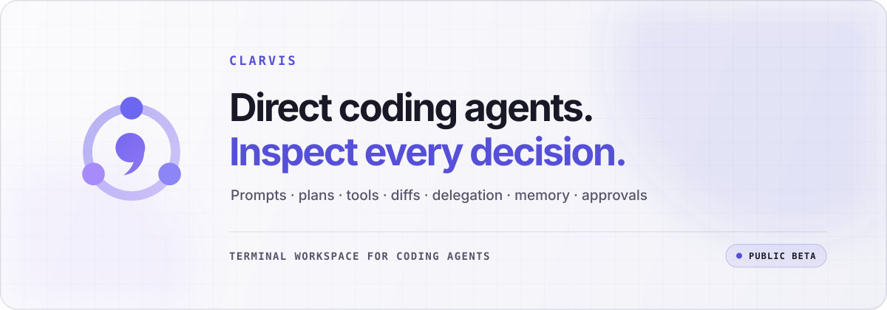

  <a href="https://clarvis.dev/">
    <picture>
      <source media="(prefers-color-scheme: dark)" srcset="./assets/hero-dark.svg">
      <source media="(prefers-color-scheme: light)" srcset="./assets/hero-light.svg">
      
    </picture>
  </a>

  
  
  

  Clarvis brings prompts, plans, tools, diffs, delegation, memory, Extension Profiles, and approvals into one terminal workspace—so you can move fast without giving up control.

  <a href="https://clarvis.dev/installation"><strong>Install Clarvis</strong></a>
  ·
  <a href="https://clarvis.dev/getting-started">First session</a>
  ·
  <a href="https://clarvis.dev/pt-BR/">Português</a>
  ·
  <a href="https://clarvis.dev/operations/security">Security</a>

---

> [!NOTE]
> The public-beta badge above reads the latest prerelease from `getclarvis/clarvis-releases`
> automatically. Behavior and reference guides may preview the next source version while installers,
> archives, and checksums remain on the current immutable public tag.

## One operating surface for agentic work

Clarvis keeps the entire run visible—from the first prompt to the verified diff. Plans, tool calls,
delegated tasks, workflow checkpoints, approvals, failures, and recovery stay in one place, while the
operating model remains yours to shape.

<table>
  <tr>
    <td width="33%" valign="top">
      <h3>Every action observable</h3>
      Inspect the plan, follow tool calls, review diffs, and see why a run changed direction.
    </td>
    <td width="33%" valign="top">
      <h3>Extensions you select</h3>
      Compose installed plugins and standalone skills through named Extension Profiles, with exact identities and workspace trust kept visible.
    </td>
    <td width="33%" valign="top">
      <h3>Safety you define</h3>
      Keep approvals explicit and choose the tools, models, permissions, and boundaries for the work.
    </td>
  </tr>
</table>

## In the current documentation preview

- **[Extension Profiles](https://clarvis.dev/guide/extension-profiles)** replace Environments with a
  clean, explicit identity across the CLI, persisted state, paths, and terminal UI.
- **[Checkpointed workflows](https://clarvis.dev/guide/workflows)** pause between semantic rounds so
  Admiral can inspect persisted results and explicitly continue or stop.
- Steering recovery, portable multiline input, and missing-session failures now settle visibly
  without leaving the terminal or the next draft in an ambiguous state.

## Explore the Clarvis ecosystem

| Project | Purpose | Start here |
| --- | --- | --- |
| **Clarvis** | The terminal workspace for directing coding agents and inspecting their work. | [Install](https://clarvis.dev/installation) · [Documentation](https://clarvis.dev/getting-started) |
| **[clarvis-releases](https://github.com/getclarvis/clarvis-releases)** | Official binary-only releases, installers, checksums, licenses, and release notes. | [Downloads](https://github.com/getclarvis/clarvis-releases/releases) · [Integrity and trust](https://github.com/getclarvis/clarvis-releases#integrity-and-trust) |
| **[marketplace](https://github.com/getclarvis/marketplace)** | The official catalog for reviewed community-contributed plugins. Listings never install or approve anything by themselves. | [Browse the catalog](https://github.com/getclarvis/marketplace/blob/main/marketplace.json) · [Contribute a plugin](https://github.com/getclarvis/marketplace/blob/main/CONTRIBUTING.md) |
| **[@clarvis/agent-tools](https://github.com/getclarvis/agent-tools)** | A transport-agnostic library of workspace tools for LLM agents: read, search, edit, patch, run, and monitor. | [Guide](https://agent-tools.clarvis.dev/getting-started) · [Security](https://github.com/getclarvis/agent-tools#security) |
| **[@clarvis/agent-skills](https://github.com/getclarvis/agent-skills)** | A pure-ESM library for discovering and serving `SKILL.md` skills through progressive disclosure. It reads skill content and executes nothing. | [Guide](https://agent-skills.clarvis.dev/getting-started) · [Security](https://github.com/getclarvis/agent-skills#security) |

> [!NOTE]
> Clarvis core source is currently maintained privately. The public beta is distributed through `clarvis-releases`; the libraries and marketplace above are developed in their own public repositories.

## Start with real work

1. **[Install the current public beta](https://clarvis.dev/installation)** for macOS, Linux, or Windows.
2. **[Connect a provider and choose your models](https://clarvis.dev/guide/providers-and-models)**—including supported provider APIs, compatible endpoints, and local inference.
3. **[Bring one project](https://clarvis.dev/getting-started)** and keep the run visible from prompt to verification.

## Trust is part of the product surface

- Portable releases include their runtime and native terminal dependencies.
- Installers validate archive integrity before activating the CLI.
- Published releases include `SHA256SUMS`, per-archive checksums, licenses, and third-party notices.
- Plugins require separate listing, installation, selection, and approval decisions; a marketplace entry grants no trust by itself.
- Suspected vulnerabilities should be reported privately through each repository's security policy—never post credentials, private prompts, or proprietary workspace contents in a public issue.

## Build with us

The public libraries and marketplace welcome focused, well-tested contributions:

- [Contribute workspace tools](https://github.com/getclarvis/agent-tools/blob/main/CONTRIBUTING.md)
- [Contribute skill discovery and serving](https://github.com/getclarvis/agent-skills/blob/main/CONTRIBUTING.md)
- [Submit or review a plugin](https://github.com/getclarvis/marketplace/blob/main/CONTRIBUTING.md)

  <a href="https://clarvis.dev/">clarvis.dev</a>
  ·
  <a href="mailto:hello@clarvis.dev">hello@clarvis.dev</a>

